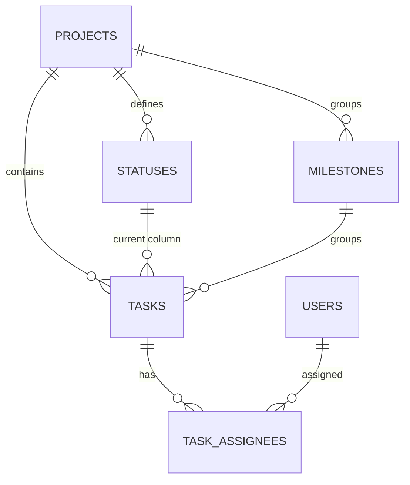

# CONES: GitHub 칸반 데이터 기반 DB 역설계

이 문서는 CONES 팀이 실제로 사용한 GitHub Issues/Projects 데이터를 바탕으로
Supabase 관계형 데이터베이스를 설계한 결과다. GitHub의 내부 데이터베이스를 복제하는 것이 아니라,
API와 보드 CSV로 확인할 수 있는 데이터를 추출한 뒤 우리 프로젝트에 맞는 구조로 정규화한다.

- 원본 보드: [cones project](https://github.com/users/seune-h0203/projects/3)
- 원본 저장소: [seune-h0203/cones](https://github.com/seune-h0203/cones)

---

## 1. 프로젝트 목표

- CONES에서 실제 사용한 Issue, 담당자, Project Status를 원본 데이터로 사용한다.
- 원본의 반복 데이터와 다대다 관계를 분석해 관계형 DB로 역설계한다.
- PK, FK, 복합 PK, UNIQUE, CHECK, 삭제 정책, RLS를 목적에 맞게 적용한다.
- 원본 데이터를 Supabase에 적재하고 JOIN 결과가 원본 보드와 일치하는지 검증한다.
- 사용하지 않은 기능까지 복제하지 않고, 실제 데이터로 필요성을 설명할 수 있는 구조만 만든다.

---

## 2. 실제 데이터 확인 결과

CONES 보드(cones project)와 저장소 Issue를 확인한 결과다.

| 항목 | 값 |
|---|---|
| 보드 상태 열 | Todo / In Progress / Done |
| 보드에 올라간 카드 | 19건 |
| 담당 계정 | `Hamchaelim`, `seune-h0203`, `ohoobae`, `qkrtpfls03` (4명) |
| 담당 배정 | 26건 (한 카드에 담당자 2명인 경우 7건) |
| 실제 사용된 Label | 없음 (제목 접두사로 대체) |

대표 샘플은 다음과 같다.

| Issue | 제목 | 담당자 | Board status |
|---|---|---|---|
| #9 | [QA] Animation 및 Interaction 최종 테스트 | Hamchaelim | In Progress |
| #13 | [PRESENTATION] 3분 발표 및 Demo 준비 | seune-h0203 | In Progress |
| #3 | [FE] 전체 페이지 콘텐츠 연결 검수 | qkrtpfls03, seune-h0203 | Done |
| #32 | [BE] Supabase 커머스 백엔드(스키마·RLS·RPC) 구축 | ohoobae, seune-h0203 | Done |
| #12 | [DEPLOY] GitHub Pages 최종 배포 확인 | Hamchaelim | Done |

### Issue state와 Project status는 다른 값이다

| 값 | 의미 | 저장 위치 |
|---|---|---|
| Issue state | Issue 자체의 열림/닫힘 상태 | `tasks.issue_state` |
| Board status | 칸반 보드에서 현재 놓인 단계 | `tasks.status_id` → `statuses` |

이슈가 닫혔는데 카드가 아직 In Progress에 있을 수 있으므로 하나의 status 문자열로 합치지 않는다.

---

## 3. 원본을 한 표로 볼 때 생기는 문제

처음 추출한 데이터는 다음과 같은 평면 구조였다.

| issue_number | title | issue_state | board_status | assignees |
|---|---|---|---|---|
| 3 | [FE] 전체 페이지 콘텐츠 연결 검수 | closed | Done | qkrtpfls03, seune-h0203 |

이 구조를 그대로 테이블로 쓰면 다음 문제가 생긴다.

- 같은 사용자·상태 문자열이 여러 행에 반복된다.
- 담당자 계정명이 바뀌면 여러 행을 동시에 수정해야 한다.
- 한 카드에 담당자가 여러 명이면 한 칸에 배열을 넣거나 행을 중복해야 한다.
- 상태 이름의 오타와 표기 차이를 막기 어렵다.

따라서 다음과 같이 분리한다.

| GitHub에서 관찰한 대상 | DB Entity | 도출 이유 |
|---|---|---|
| Repository / Project | `projects` | 업무의 소속 단위 |
| GitHub User | `users` | 반복되는 담당자 정보 분리 |
| Issue | `tasks` | 관리할 업무 단위 |
| Project Status | `statuses` | 상태 이름과 표시 순서 통제 |
| Milestone | `milestones` | 여러 Task가 공유하는 목표 분리 |
| Issue Assignee | `task_assignees` | Task와 User의 N:M 관계 표현 |

---

## 4. ERD



- Project 1:N Status
- Project 1:N Milestone
- Project 1:N Task
- Status 1:N Task
- Milestone 1:N Task
- **Task N:M User → `task_assignees`**

---

## 5. 테이블 구조

| 테이블 | 주요 컬럼 | 핵심 설계 |
|---|---|---|
| `projects` | `project_id`, `project_name`, `github_repo_full_name`, `github_project_number` | 보드와 저장소 식별자 보존 |
| `users` | `user_id`, `github_username`, `display_name` | `github_username`을 UNIQUE로 관리 |
| `statuses` | `status_id`, `project_id`, `status_name`, `position`, `is_done` | 상태 이름과 순서를 데이터로 관리 |
| `milestones` | `milestone_id`, `project_id`, `github_milestone_number`, `title`, `state` | 프로젝트 안에서 번호를 UNIQUE 처리 |
| `tasks` | `task_id`, `project_id`, `status_id`, `milestone_id`, `github_issue_number`, `title`, `body`, `issue_state`, `created_at`, `closed_at` | Issue state와 Board status를 별도 저장 |
| `task_assignees` | `task_id`, `user_id`, `assigned_at` | 복합 PK로 같은 사람의 중복 배정 방지 |

### 주요 컬럼 설명

**statuses**

| 컬럼 | 설명 |
|---|---|
| `status_name` | 보드에 표시할 상태 이름. Todo / In Progress / Done |
| `position` | 보드에서 열을 표시할 순서. 0부터 시작 |
| `is_done` | 칸반상 완료 열로 취급할지 여부. Issue의 `closed`와는 별개 개념 |

**tasks**

| 컬럼 | 설명 |
|---|---|
| `github_issue_number` | 저장소 안에서 Issue를 표시하는 번호. 예: #32 |
| `status_id` | 카드가 현재 놓인 보드 열 |
| `issue_state` | Issue 자체의 `open` / `closed`. `status_id`와 구분 |
| `milestone_id` | 연결된 마일스톤. 없으면 NULL |
| `created_at` / `closed_at` | 원본 Issue의 생성·종료 시각 |

---

## 6. 무결성 설계

### PK와 UNIQUE

- 독립 Entity는 단일 PK를 가진다.
- 관계 자체가 식별자인 `task_assignees`는 `(task_id, user_id)` 복합 PK를 사용한다.
- `users.github_username`은 UNIQUE로 관리한다.
- `statuses`에는 `UNIQUE(project_id, status_name)`과 `UNIQUE(project_id, position)`을 둔다.
- `tasks`에는 `UNIQUE(project_id, github_issue_number)`를 둔다.
- `milestones`에는 `UNIQUE(project_id, github_milestone_number)`를 둔다.

### CHECK

- `statuses.position >= 0`
- `tasks.issue_state IN ('open', 'closed')`
- `tasks.closed_at IS NULL OR closed_at >= created_at`

### 삭제 정책

- Project와 생명주기를 공유하는 하위 데이터(Status, Milestone, Task)는 `ON DELETE CASCADE`.
- Task 삭제 시 담당 관계(`task_assignees`)도 함께 삭제한다.

---

## 7. Supabase RLS

- `public` 스키마의 모든 테이블에 RLS를 활성화했다.
- 데이터 적재·동기화 작업은 `service_role` 기준으로 수행한다.
- Access Token 등 비밀값은 저장소와 문서에 포함하지 않는다.

---

## 8. 검증

보드 화면과 DB 조회 결과가 일치하는지 SQL로 확인한다.

**상태별 카드 수**

```sql
SELECT s.status_name, COUNT(*)
FROM tasks t
JOIN statuses s ON t.status_id = s.status_id
GROUP BY s.status_name, s.position
ORDER BY s.position;
```

**칸반 보드 재현**

```sql
SELECT s.status_name AS 상태,
       t.github_issue_number AS 이슈번호,
       t.title AS 제목,
       string_agg(u.github_username, ', ') AS 담당자
FROM tasks t
JOIN statuses s ON t.status_id = s.status_id
LEFT JOIN task_assignees ta ON t.task_id = ta.task_id
LEFT JOIN users u ON ta.user_id = u.user_id
GROUP BY s.status_name, s.position, t.github_issue_number, t.title
ORDER BY s.position, t.github_issue_number;
```

**담당자가 2명 이상인 카드 (N:M 근거)**

```sql
SELECT t.github_issue_number, t.title, COUNT(*) AS assignee_count
FROM task_assignees ta
JOIN tasks t ON ta.task_id = t.task_id
GROUP BY t.github_issue_number, t.title
HAVING COUNT(*) >= 2
ORDER BY t.github_issue_number;
```

**Issue state와 Board status가 어긋난 카드**

```sql
SELECT t.github_issue_number, t.title, t.issue_state, s.status_name
FROM tasks t
JOIN statuses s ON t.status_id = s.status_id
WHERE (s.is_done = true  AND t.issue_state = 'open')
   OR (s.is_done = false AND t.issue_state = 'closed');
```

### 적재 결과

| 테이블 | 건수 |
|---|---:|
| projects | 1 |
| users | 4 |
| statuses | 3 |
| milestones | 1 |
| tasks | 19 |
| task_assignees | 26 |

---

## 9. 설계 → 실제 데이터 투입 후 수정 기록

| 발견한 문제 | 처음 설계 | 수정 내용 | 이유 |
|---|---|---|---|
| 담당자가 2명인 카드 7건 | tasks에 담당자 컬럼 1개 | `task_assignees` 중간 테이블 분리 | 한 칸에 두 값을 넣을 수 없음 (N:M) |
| 보드 export에 마일스톤 없음 | `milestone_id` 필수 가정 | Nullable 처리 | 보드 CSV 범위 밖의 데이터 |
| 보드 상태와 이슈 상태 혼동 | 하나의 status 문자열 고려 | `status_id`와 `issue_state` 분리 | 두 값은 서로 다른 개념 |
| 대량 INSERT 실패 | 단일 트랜잭션 일괄 적재 | 배치로 나눠 적재 후 건수 검증 | 트랜잭션 크기 초과 |

---

## 10. 이번 범위에서 제외하는 것

CONES 보드는 GitHub Label 대신 제목 접두사(`[QA]`, `[FE]`, `[BE]`, `[DB]`, `[PLAN]`,
`[CONTENT]`, `[DEPLOY]`, `[DEVOPS]`, `[FIX]`, `[DOCS]`, `[PRESENTATION]`)로 작업 종류를 구분했다.
실제로 Label을 사용하지 않았으므로 `labels` / `task_labels`는 1차 설계에서 제외한다.
댓글, 타임라인 이벤트, 상태 변경 이력, 팀 소유권 구조도 실제 요구가 확인될 때 추가한다.

이 원칙은 "GitHub가 제공하는 모든 기능을 복제"하는 것이 아니라
"우리 팀이 실제로 사용한 기능을 근거로 설계"하기 위한 것이다.

---

## 발표용 핵심 설명

> 실제 사용한 GitHub Projects 칸반 보드와 Issue 데이터를 추출한 뒤, 반복되는 사용자·상태 문자열과
> 다대다 담당 관계를 발견해 관계형 DB로 정규화했습니다. 한 카드에 담당자가 둘인 경우가 7건 있어
> 중간 테이블로 표현했고, 보드 위치와 이슈 상태를 별도 컬럼으로 구분해
> 복합 키·제약조건·RLS까지 적용한 칸반 DB를 Supabase에 구현했습니다.
