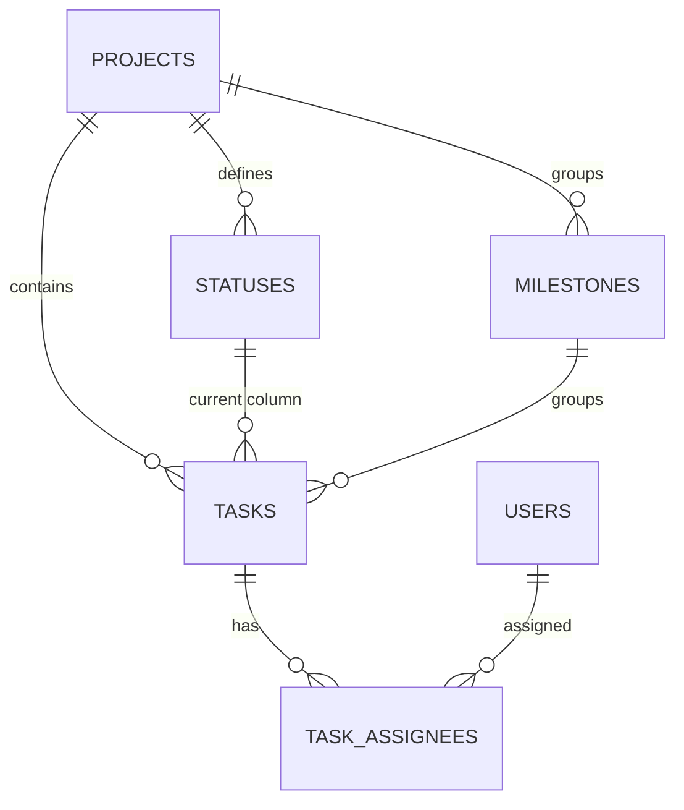

# CONES 칸반 보드 DB 역설계

CONES 팀이 실제로 사용한 GitHub Projects 칸반 보드를 관계형 데이터베이스로 역설계하고 Supabase에 구축한 결과입니다.

- 원본 보드: [cones project](https://github.com/users/seune-h0203/projects/3)
- 원본 저장소: [seune-h0203/cones](https://github.com/seune-h0203/cones)

---

## 1. 프로젝트 목표

GitHub 보드 화면에는 `Todo`, `In Progress`, `Done` 열과 작업 카드가 표시됩니다.
화면에 보이는 정보를 한 테이블에 그대로 복사하지 않고, 반복되는 데이터와 관계를 분리해
보드·상태·카드·담당자를 각각 관리할 수 있는 DB로 설계했습니다.

- 한 보드에는 어떤 상태 열이 있는가?
- 각 카드는 어느 열에 놓여 있는가?
- 한 카드에 담당자가 여러 명이면 어떻게 저장하는가?
- 카드가 "닫힌 이슈"인 것과 "Done 열에 있는 것"은 같은 값인가?

---

## 2. 원본 데이터 분석과 정규화

보드에서 관찰한 정보를 아래와 같이 분리했습니다.

| GitHub 보드에서 관찰한 정보 | DB Entity | 분리한 이유 |
|---|---|---|
| 저장소 / 보드 | `projects` | 보드 이름·저장소 식별자를 한 번만 저장 |
| Todo / In Progress / Done | `statuses` | 열 이름과 표시 순서를 데이터로 관리 |
| Issue 번호, 제목, 본문, 상태 | `tasks` | 실제 작업 단위 |
| 담당자 (아바타) | `users` | 카드마다 반복되는 계정 정보 분리 |
| 카드-담당자 배정 | `task_assignees` | 한 카드에 담당자가 여러 명 → N:M |
| 마일스톤 | `milestones` | 여러 카드가 공유하는 목표 |

### 평면 구조로 두면 생기는 문제

처음 추출한 보드 데이터는 아래와 같은 한 장의 표였습니다.

| title | assignees | status |
|---|---|---|
| [FE] 전체 페이지 콘텐츠 연결 검수 | qkrtpfls03, seune-h0203 | Done |

- 같은 담당자 이름이 여러 행에 반복됩니다.
- 한 카드에 담당자가 둘이면 한 칸에 두 값을 넣어야 합니다.
- 상태 이름의 표기 차이와 오타를 막을 수 없습니다.

그래서 담당자는 `users`로, 배정 관계는 `task_assignees`로 분리했습니다.

### 이 설계의 핵심: 이슈 상태와 보드 상태의 분리

| 값 | 의미 | 저장 위치 |
|---|---|---|
| Issue state | 이슈 자체의 열림/닫힘 | `tasks.issue_state` |
| Board status | 칸반 보드에서 카드가 놓인 열 | `tasks.status_id` → `statuses` |

두 값은 항상 일치하지 않습니다. 이슈가 닫혔는데 카드가 아직 In Progress에 남아 있을 수 있습니다.
따라서 하나의 문자열로 합치지 않고 별도 컬럼으로 저장했습니다.

---

## 3. Conceptual ERD



- Project 1 : N Status — 하나의 보드는 여러 상태 열을 가집니다.
- Project 1 : N Task — 하나의 보드는 여러 작업 카드를 가집니다.
- Status 1 : N Task — 하나의 열에는 여러 카드가 놓입니다.
- Milestone 1 : N Task — 하나의 목표에 여러 카드가 묶입니다.
- **Task N : M User** — `task_assignees` 중간 테이블로 표현합니다.

---

## 4. 테이블 구조

| 테이블 | 책임 | 주요 컬럼 |
|---|---|---|
| `projects` | 보드와 저장소 식별 | `project_id`, `project_name`, `github_repo_full_name`, `github_project_number` |
| `users` | GitHub 담당자 계정 | `user_id`, `github_username`, `display_name` |
| `statuses` | 보드의 상태 열과 순서 | `status_id`, `project_id`, `status_name`, `position`, `is_done` |
| `milestones` | 공유 목표 | `milestone_id`, `project_id`, `github_milestone_number`, `title`, `state` |
| `tasks` | 작업 카드(Issue) | `task_id`, `project_id`, `status_id`, `milestone_id`, `github_issue_number`, `title`, `body`, `issue_state`, `created_at`, `closed_at` |
| `task_assignees` | 카드-담당자 배정 | `task_id`, `user_id`, `assigned_at` (복합 PK) |

---

## 5. 무결성 규칙

| 규칙 | 적용 방식 | 목적 |
|---|---|---|
| 보드 삭제 시 하위 데이터 정리 | `ON DELETE CASCADE` | 고아 Status/Task 방지 |
| 카드 소속 관계 보장 | `project_id`, `status_id`, `milestone_id` 외래키 | 잘못된 참조 방지 |
| 열 순서 음수 방지 | `CHECK (position >= 0)` | 화면 정렬 데이터 보호 |
| 이슈 상태값 오입력 방지 | `CHECK (issue_state IN ('open','closed'))` | 허용값만 저장 |
| 종료 시각 모순 방지 | `CHECK (closed_at IS NULL OR closed_at >= created_at)` | 닫힌 시각이 생성보다 앞설 수 없음 |
| 카드 중복 적재 방지 | `UNIQUE (project_id, github_issue_number)` | 같은 이슈가 두 번 들어가지 않음 |
| 담당자 중복 배정 방지 | `(task_id, user_id)` 복합 PK | 같은 사람이 한 카드에 두 번 배정되지 않음 |
| 상태 이름·순서 중복 방지 | `UNIQUE (project_id, status_name)`, `UNIQUE (project_id, position)` | 같은 보드에 같은 열이 두 개 생기지 않음 |

---

## 6. 샘플 데이터

실제 CONES 보드에서 확인한 데이터를 Supabase에 입력했습니다.

| 테이블 | 건수 |
|---|---:|
| projects | 1 |
| users | 4 |
| statuses | 3 |
| milestones | 1 |
| tasks | 19 |
| task_assignees | 26 |

담당자: `Hamchaelim`, `seune-h0203`, `ohoobae`, `qkrtpfls03`

### 대표 샘플

| 상태 열 | Issue | 작업 카드 | 담당자 |
|---|---|---|---|
| In Progress | #9 | [QA] Animation 및 Interaction 최종 테스트 | Hamchaelim |
| In Progress | #13 | [PRESENTATION] 3분 발표 및 Demo 준비 | seune-h0203 |
| In Progress | #39 | [PRESENTATION] 발표 대본 준비 | ohoobae |
| Done | #3 | [FE] 전체 페이지 콘텐츠 연결 검수 | qkrtpfls03, seune-h0203 |
| Done | #32 | [BE] Supabase 커머스 백엔드(스키마·RLS·RPC) 구축 | ohoobae, seune-h0203 |
| Done | #12 | [DEPLOY] GitHub Pages 최종 배포 확인 | Hamchaelim |

카드 19건에 대해 배정은 26건입니다. **담당자가 2명인 카드가 7건** 있었고,
이것이 `task_assignees` 중간 테이블이 필요했던 직접적인 근거입니다.

---

## 7. Supabase 보안 구성

- `public` 스키마의 모든 테이블에 Row Level Security(RLS)를 활성화했습니다.
- 데이터 적재·동기화 작업은 `service_role` 기준으로 수행합니다.
- Access Token 등 비밀값은 저장소와 문서에 포함하지 않습니다.

---

## 8. 구현 및 검증

보드 화면과 DB 조회 결과가 일치하는지 SQL로 확인했습니다.

### 상태별 카드 수

```sql
SELECT s.status_name, COUNT(*)
FROM tasks t
JOIN statuses s ON t.status_id = s.status_id
GROUP BY s.status_name, s.position
ORDER BY s.position;
```

### 칸반 보드 재현

```sql
SELECT s.status_name AS 상태,
       t.github_issue_number AS 이슈번호,
       t.title AS 제목,
       string_agg(u.github_username, ', ') AS 담당자
FROM tasks t
JOIN statuses s ON t.status_id = s.status_id
LEFT JOIN task_assignees ta ON t.task_id = ta.task_id
LEFT JOIN users u ON ta.user_id = u.user_id
GROUP BY s.status_name, s.position, t.github_issue_number, t.title
ORDER BY s.position, t.github_issue_number;
```

### 담당자가 2명 이상인 카드 (N:M 근거)

```sql
SELECT t.github_issue_number, t.title, COUNT(*) AS assignee_count
FROM task_assignees ta
JOIN tasks t ON ta.task_id = t.task_id
GROUP BY t.github_issue_number, t.title
HAVING COUNT(*) >= 2
ORDER BY t.github_issue_number;
```

### 이슈 상태와 보드 상태가 어긋난 카드

```sql
SELECT t.github_issue_number, t.title, t.issue_state, s.status_name
FROM tasks t
JOIN statuses s ON t.status_id = s.status_id
WHERE (s.is_done = true  AND t.issue_state = 'open')
   OR (s.is_done = false AND t.issue_state = 'closed');
```

---

## 9. 설계 → 실제 데이터 투입 후 수정 기록

| 발견한 문제 | 처음 설계 | 수정 내용 | 이유 |
|---|---|---|---|
| 담당자가 2명인 카드 7건 | tasks에 담당자 컬럼 1개 | `task_assignees` 중간 테이블 분리 | 한 칸에 두 값을 넣을 수 없음 (N:M) |
| 보드 export에 마일스톤 없음 | `milestone_id` 필수 가정 | Nullable 처리 | 보드 CSV 범위 밖의 데이터 |
| 보드 상태와 이슈 상태 혼동 | 하나의 status 문자열 고려 | `status_id`와 `issue_state` 분리 | 두 값은 서로 다른 개념 |
| 대량 INSERT 실패 | 단일 트랜잭션으로 일괄 적재 | 배치로 나눠 적재 후 건수 검증 | 트랜잭션 크기 초과 |

---

## 10. 이번 범위에서 제외한 것

CONES 보드는 GitHub Label 대신 제목 접두사(`[QA]`, `[FE]`, `[BE]`, `[DB]`, `[PLAN]`,
`[CONTENT]`, `[DEPLOY]`, `[DEVOPS]`, `[FIX]`, `[DOCS]`, `[PRESENTATION]`)로 작업 종류를 구분했습니다.
실제로 Label을 사용하지 않았으므로 `labels` / `task_labels`는 1차 설계에서 제외했습니다.
댓글, 타임라인 이벤트도 같은 기준으로 제외했습니다.

"GitHub의 모든 기능을 복제"하는 것이 아니라 **우리 팀이 실제로 사용한 기능을 근거로 설계**하는 것이 원칙입니다.

---

## 발표용 한 문장

> GitHub 칸반 화면에서 반복되던 담당자·상태·목표 정보를 분리해 Project–Status–Task 구조로 정규화했고,
> 한 카드에 담당자가 둘인 경우가 7건 있어 중간 테이블로 N:M 관계를 표현했으며,
> 보드 위치와 이슈 상태를 별도 컬럼으로 구분해 실제 Supabase에서 조회 가능한 칸반 DB를 구현했습니다.
